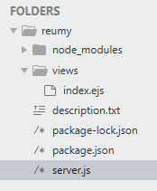

## 0512
- 폴더현황

<br/>

## 프로젝트 만들기 전 세팅
1. node 설치
- Nodejs 홈페이지에서 설치
- npm은 자동설치됨

2. 프로젝트 생성
- 하나의 프로젝트 당 하나의 폴더를 사용

3. 프로젝트 명세
- 배포의 이유
```
npm init
```

4. 웹서버
- 사람들이 접속할 수 있게함
- 아파치, 엔진엑스, 노드 ...
- 프레임워크 패키지 : 웹을 만드는데 틀이 갖춰진 것
  - Express 사용할 예정
  - npm express 검색해서 버전확인 (앞번호가 바뀌면 대규모 변화가 일어난 것)
```
npm install express --save
```
- `--save : 해당 폴더에서만 사용`
- `-g : 컴퓨터 전역에서 사용 (비추)`

5. 라우트 설정
- GET(조회), POST(입력), UPDATE(수정), DELETE(삭제)

6. 템플릿 엔진
- HTML, CSS를 편하게 작성하기 위함
- 변수를 넘겨줄 수 있음
- pug, handelbars, ejs ...
  - ejs 사용예정

7. 데이터베이스
- 하나의 프로젝트에 하나의 DB 사용
- UTF-8 (한번 설정해주면 자식들이 다 따라옴)
- PK(Primary Key) : 고정 키
- FK(Foreign Key) : 키들끼리 연결됨 (연결된 것들이 전부 삭제되어야 삭제되는 것)

### 그외
- `.`을 찍는 순간 자바스크립트에선는 객체가 됨
- 오늘 작업한 환경은 터미널이 꺼지면 서버가 끊김
- 패키지를 복수로 설치
```
npm install express ejs --save
```
> 한칸띄우고 같이 쓰면 됨
- 노트북 mysql 포트:9999

### 공부할 것
- nodejs 이론
- PORT, HOST 공부하기
- 데이터베이스의 데이터타입은 많이 쓰이는것을 공부

### 오늘 해야할 것
1. node 서버실행 방법과 서버를 이용해 화면에 출력하기 (연결 후 html확인하고 콘솔실행 해보기 ...)
2. mysql 사용법 명령어 공부 (기본 4가지)
  - mysql ui 툴 : 워크벤치

### 다음주
- node에서 database 컨트롤
