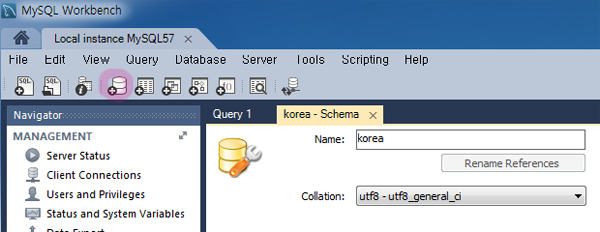
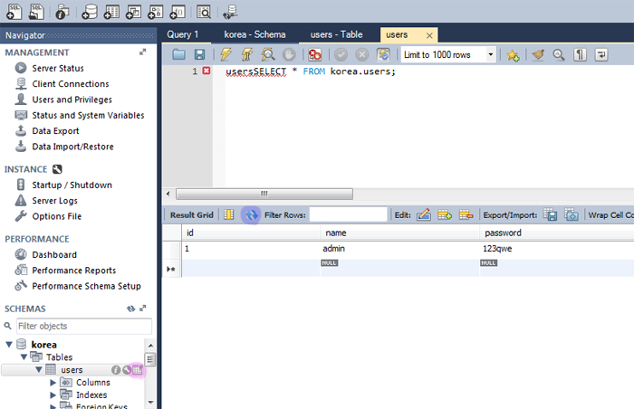

## MySQL Workbench
- MySQL GUI 프로그램
- MySQL을 다운받으면 자동으로 다운받아지지만 없을경우 직접설치
- [MySQL 홈페이지](https://dev.mysql.com/downloads/workbench/)에서 다운
- 로그인, 회원가입 창에서 "No thanks, just start my download." 를 누르면 가입없이 다운가능

#### 1. 설치 후 실행
- 자신이 만든 MySQL 서버를 선택해서 비밀번호입력 후 Database에 접속
- 마지막에는 Apply를 항상 누르기

#### 2. 데이터베이스 생성



- `korea` 이름의 데이터베이스 생성
- Collation은 utf8 - utf_general_ci 선택
  - 한번 선택하면 그 아래 자식들은 다 따라감

#### 3. 테이블 생성


- `users` 이름의 테이블 생성
- id, name, password를 만듬
  - PK(primary key) : 기본키 \/ 데이터의 고유성을 보장 \/ id열에 주로 사용
  - NN(not null) : 값이 반드시 들어와야함 \/ id열에 반드시 사용
  - UQ(unique index) : 중복되는 값이 없도록 막아줌 \/ id열에 주로 사용
  - AI(auto incremental) : 해당 값이 없을경우 자동으로 숫자를 증가시킴

#### 4. MySQL cmd에서 데이터 직접 추가
- 워크벤치에서 직접 데이터를 추가할 수 있지만 MySQL cmd에서도 연동이 되는지 확인해보기
```
USE korea;
```
```
INSERT INTO users (name, password) VALUES ('admin', '123qwe');
```
- 확인


> id에 값은 입력하지 않아서 auto incremental에 의해 자동으로 숫자가 부여됨

- 직접 입력할때는 원하는 데이터행을 더블클릭하면 입력할 수 있음


### TIP
- npm 설치시 설치취소도 ctrl + c로 가능


### 공부해야할 것
- 인코딩, 디코딩
- npm express session : 로그인을 유지시키고 로그인, 로그아웃을 쉽게 가능하게함
- mvc
