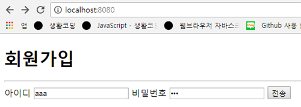
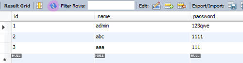

## 세팅
#### 1. npm 설치
```
npm install express ejs body-parser supervisor --save
```


#### 2. npm 가져오기 & 라우트
```
const express = require('express');
const app = express();
const bodyParser = require('body-parser');
```
```
app.listen(8080);
```
- `body-paser : post 방식으로 라우트할때 body 프로퍼티로 데이터를 가져오게 되는데 그때 parser를 이용해 넘어오는 데이터를 기계언어가 아닌 사람이 알 수 있는 언어로 가져옴`


#### 3. database 연결
```
var mysql      = require('mysql');
var connection = mysql.createConnection({
  host     : 'localhost',
  user     : 'root',
  password : '****',
  database : 'korea'
});
```
- 연결확인
```
connection.connect(function(err){
  if (err) {
    console.log(err);
    return;
  }
  console.log('connect succes!')
});
```


#### 4. 템플릿 엔진
```
app.set('views', __dirname + '/views');
app.set('view engine', 'ejs');
app.use(bodyParser.json());
app.use(bodyParser.urlencoded({ extended : true }));
```
- `.use : 미들웨어를 의미`
- `미들웨어 : 서버가 실행하기전에 실행해 중간에 어떤 기능을 심어주는 것`
- `bodyParser.json() : body를 json 형태로 받음`
- `bodyParser.urlencoded({ extended : true }) : body가 인코딩해서 사람이 볼 수 있게 함`

```
app.get('/',(req,res)=>{
  res.render('join');
})
```
> 홈으로 접속했을때 join.ejs를 출력

join.ejs
```
<!DOCTYPE html>
<html>
<head>
<meta charset="UTF-8">
<title>Title of the document</title>
</head>
<body>

  <h1>회원가입</h1>
  <hr/ >

  <form action="/register" method="POST">
    아이디 <input type="text" name="name" />
    비밀번호 <input type="password" name="password" />
    <button type="submit">전송</button>
  </form>

</body>
</html>
```
> submit하면 해당 정보가 register로 넘어감

- `name : 해당 정보가 어떤 이름으로 넘어갈지 정의`
- 실행
```
node server.js
```
- 접속
```
localhost:8080
```
- 결과
```
Cannot POST /register
```
> 아직은 register에 대해 라우트가 안된상태
- 접속2
```
http://localhost:8080/register
```
- 결과
```
Cannot GET /register
```
> 주소를 직접쳐서 들어갔으니 GET방식이 됨

- 이렇게 들어온는 방식에따라 달라지기때문에 POST, GET 둘다 라우트를 해줘야 함


## 회원가입
- 회원가입이라서 보안의 이유로 POST 방식을 라우트함
```
app.post('/register',(req,res)=>{
  console.log(req.body);
});
```
> 응답해줄것이 정의되지 않아서 무한로딩 됨


#### 1. 입력한 정보를 데이터베이스에 추가
- req.body 객체에서 name과 password를 추출해서 해당 데이터를 데이터베이스에 삽입하기
```
app.post('/register',(req,res)=>{
  connection.query('INSERT INTO users SET ?', req.body, function (err, rows){
    if (err) {
      console.log(err);
      return;
    }
    res.redirect('/login');
  });
});
```
> req.body를 두번째 인자로주면 그 안에 전송한 데이터가 객체형태로 넘어옴<br/>즉, \[{name:req.body.name, password:req.body.password}] 이 형태로 넘어옴<br/>단, 데이터베이스의 컬럼이름과 넘어올 정보의 이름이 각각 같기때문에 req.body만 해줘도 가능한 것

- `redirect() : 사용자를 인자의 루트로 이동시킴`

- 입력

<br/>

- 결과
```
Cannot GET /login
```


> login를 라우트해주지 않아서 오류메세지가 뜨지만 데이터베이스를 확인해보면 입력한값이 데이터로 추가됨


#### 2. 중복된 아이디일때 경고창 띄우기
```
app.post('/register',(req,res)=>{
  connection.query('SELECT * FROM users WHERE name="' + req.body.name + '"', function(err, rows){
    if (err) {
      console.log(err);
      return;
    }
    if (rows.length > 0){
      res.send('<script>alert("아이디가 이미 있음");location.href="/";</script>')
    } else {
      connection.query('INSERT INTO users SET ?', req.body, function (err, rows){
        if (err) {
          console.log(err);
          return;
        }
        res.redirect('/login');
      });
    }
  });
});
```
- 코드분석
```
connection.query('SELECT * FROM users WHERE name="' + req.body.name + '"', function(err, rows){...});
```
> name="'+req.body.name+'" 이 코드를 통해 사용자가 전송한 name값을 데이터베이스에서 조회할 수 있음
```
if (rows.length > 0){
  res.send('<script>alert("아이디가 이미 있음");location.href="/";</script>')
}
```
> 넘어온 name값이 데이터베이스에 있다면 rows의 갯수는 1이 될거고 1은 0보다 크기때문에 이미 해당 name이 존재한다는 사실을 알 수 있으므로 다시 홈으로 이동시킴

- res.redirect('/') 를 하지않고 스크립트 태그안에 href로 이동시킨 이유
> 응답(res)은 한번만 할 수 있음
```
connection.query('INSERT INTO users SET ?', req.body, function (err, rows){
  if (err) {
    console.log(err);
    return;
  }
  res.redirect('/login');
});
```
> 중복되는 아이디(name)가 없다면 login페이지로 이동시킴


## 로그인
- 로그인에 성공하면 메인(main) 페이지로 이동, 아이디가 틀리면 회원가입(register) 페이지로, 비밀번호가 틀리면 다시 로그인(login) 페이지로 이동


#### 1. 페이지 생성
login.ejs
```
<!DOCTYPE html>
<html>
<head>
<meta charset="UTF-8">
<title>Title of the document</title>
</head>
<body>

  <h1>로그인</h1>
  <hr/ >

  <form action="/check" method="POST">
    아이디 <input type="text" name="name" />
    비밀번호 <input type="password" name="password" />
    <button type="submit">전송</button>
  </form>

</body>
</html>
```
> 로그인 페이지의 정보는 check로 라우트 됨

main.ejs
```
<!DOCTYPE html>
<html>
<head>
<meta charset="UTF-8">
<title>Title of the document</title>
</head>
<body>

  <h1>메인페이지</h1>

</body>
</html>
```


#### 2. 코드작성
```
app.post('/check',(req,res)=>{
  connection.query('SELECT * FROM users WHERE name="' + req.body.name + '"', function(err, rows){
    if (err) {
      console.log(err);
      return;
    }
    if (rows.length > 0) {
      if (rows[0].password == req.body.password) {
        res.redirect('/main');
      } else {
        res.redirect('/login');
      }
    } else {
      res.redirect('/');	
    }
  });
});
```
- 코드분석
```
connection.query('SELECT * FROM users WHERE name="'+req.body.name+'"', function(err, rows){...});
```
> 입력하는 아이디(name)값을 데이터베이스에서 검색해서 해당 name의 모든 정보를 가져옴

> \[{id:??, name:??, password:?? }] 이런식으로 모든 정보가 배열안에 '하나'의 요소로만 넘어옴<br/>이유는 회원가입 당시 하나의 아이디로만 가입이 가능했기때문에 유니크한 값이라는 것이 입증된 셈

```
if (rows.length > 0) {...}
```
> 만약 해당 아이디 있다면 해당 코드를 실행
```
if (rows[0].password == req.body.password) {...}
```
> 첫번째 배열 즉, 해당 정보의 비밀번호가 전송시킨 비밀번호와 같다면 해당 코드를 실행

> 애초에 req.body가 하나의 요소만을 가지고 있기 때문에 rows[0]이 모든 정보를 가르키게 되는 것

- 접속
```
localhost:8080/login
```
> 최상위 객체( / )는 회원가입(join) 페이지로 되어있음
