### react
## 적용2
List.js
```
class List extends Component{

  state = {
    num : 10
  }

  render(){

    //let num = 10;
    const {num} = this.state;

    return (
      <div>
        <h1>List 컴포넌트</h1>
        <div>List 컴포넌트가 만든 state 변수 num은 {num}</div>
        <button>숫자증가</button>
        <hr />
        <Open count={num} />  			
      </div>
    )
  }
}
```
- 분석
```
state = {
  num : 10
}
```
> 컴포넌트 자신이 만든 데이터로 변수명을 반드시 state로 해주고 시작이 객체여야 함
```
const {num} = this.state;
```
> 여기에서 this는 List를 가르킴

- 코드수정
```
class List extends Component{

  constructor(){
    super();
    this.state = {
      num : 10
    }
  }

  render(){...}
}
```
> this.state = {} 는 자신이 만든 것이며 이렇게 코드를 작성하면 위에보다 편의성이 높아짐

- `constructor : 생성자, 최초에 실행`
- `super() : 오버라이딩을 막아줌, 생성자가 한번만 읽힘`
> 부모를 실행시켜 주기위해서는 super.* 을 사용함 그냥 실행하면 자식을 실행시키기 때문

```
handleClick(){
  console.log(this);
}
```
```
<button onClick={this.handleClick()}>숫자증가</button>
```
- 결과

<br/>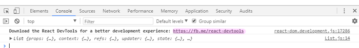
> this를 인식하지 못함

#### react-devtools 클릭 후 설치하기

<br/>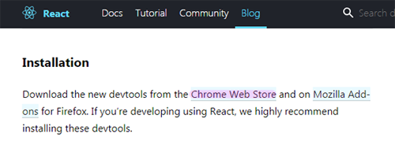
> Chrome Web Store를 클릭해서 CHROME에 추가함

<br/>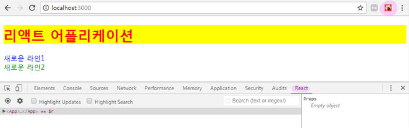
> 개발자도구에 react가 생기고 react로 만들어진 사이트에 접속하면 아이콘이 주황색으로 바뀜

```
<button onClick={this.handleClick.bind()}>숫자증가</button>
```
> bind를 해줘야 실행됨 하지만 여전히 this를 인식하지 못해서 결과는 undefined

```
handleClick = () => {
  console.log(this);
}
```
> 단, es6 문법으로 사용시에는 인식함

```
<button onClick={this.handleClick.bind(this)}>숫자증가</button>
```
> bind(this)를 해줘야 this가 자신이 this인것을 알고 List를 가르킴

- 결과
<br/>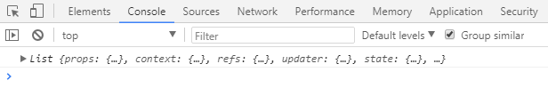<br/>

- 현재 환경은 웹이 아니기때문에 this가 없다. 자바스크립트에서는 웹 환경이라서 this가 전역객체 windows를 가르키지만 현재는 단순히 하나의 파일이기때문에 전역 this가 없기때문이다.


- 숫자증가 시키기
```
handleClick(){
  this.setState({num:this.state.num + 1});
}
```
> 숫자증가 버튼을 누를때마다 모든 num이 1씩 증가함<br/>이것은 상위 컴포넌트가 메소드를 가지고 있는 것이며 실제로 상위에서 실행되지만 하위 컴포넌트에서 실행되는것처럼 보이는 것뿐이다.


## 라이프 사이클 (메소드 실행순서)
- constructor : 클래스 실행시 최초 실행
- render : 그리다, 붙이다(mount) \/ 실제 코드가 붙었을 때 실행
- componentWillMount : render 전에 실행 (mount할때 최초 1번만 실행) → react 16.3부터 없어질 예정
  - render 전에 실행하면 선택자를 조회할 수 없음(만들어지기 전이기 때문) 그래서 잘 사용하지 않음
- componentDidMount : render 후에 실행 (mount할때 최초 1번만 실행) → AJAX, HTTP ...
- componentWillReceiveProps : props가 변경됐을때(update) 실행, 파라미터 제공
- shouldComponentUpdate : 리랜더링을 할지말지 정함 (중요!)
  - return이 필수이며 true 이면 리랜더링 false이면 리랜더링을 하지 않음
  - 즉, 자신만 랜더링이 필요하고 하위들은 랜더링이 필요없을 경우 사용
- componentWillUpdate : render 실행 후 업데이트 하기 전 실행
- componentDidUpdate : render 실행 후 업데이트 된 후 실행
- componentWillUnmount
> \*Will\* : 전부 없어질 예정

Open.js
```
class Open extends Component{

  constructor(){
    super();
    console.log('constructor');
  }

  componentWillMount(){
    console.log('componentWillMount');
  }

  componentDidMount(){
    console.log('componentDidMount');
  }

  render(){
    console.log('render');
    const {count} = this.props;
    return (...)
  }
}
```
- 결과

<br/>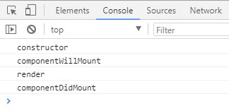<br/>

```
shouldComponentUpdate(nextProps, nextState){
  if(nextProps.count > 20){
    return false;
  }
  return true;
}
```
> 숫자증가 버튼을 눌러서 숫자를 증가시킬때 20 부터는 List 컴포넌트의 숫자만 증가함

- 리액트는 바뀐부분만 다시 그린다. 즉, 랜더링을 한번 저장해놓고 바뀌려는 랜더링과 비교해서 똑같으면 넘어가고 달라지는 특정 부분만 업데이트한다. 하지만 그래도 render 메소드는 실행된다. 그래서 render 메소드 자체가 실행 안되게 하는것이 shouldComponentUpdate<br/>즉, 상위 컴포넌트가 랜더링되면 하위 컴포넌트들은 자동으로 랜더링 되고 불필요한 랜더링이 일어날경우 성능의 저하가 일어남으로 하위 랜더링을 막을 때 shouldComponentUpdate를 사용한다.

```
componentWillReceiveProps(nextProps){
  console.log('componentWillReceiveProps');
}
```
- 결과

<br/>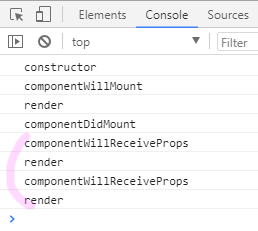
> 숫자증가 버튼을 누를때마다 componentWillReceiveProps 가 실행되고 render가 실행됨
```
componentWillReceiveProps(nextProps){
  console.log(nextProps)
  console.log('componentWillReceiveProps');
}
```
- 결과

<br/>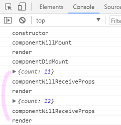<br/>

```
componentWillUpdate(){
  console.log('componentWillUpdate');
}

componentDidUpdate(){
  console.log('componentDidUpdate');
}
```
- 결과

<br/>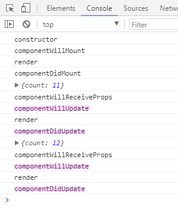
> render 앞뒤로 *Update 메소드가 생김
- *Update가 없을경우

<br/>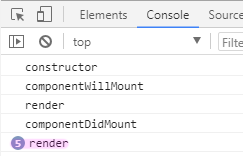
> render에만 숫자가 올라감

- 그래서, \*Update() 메소드에 setState를 쓰게되면 무한루프에 빠짐

- 개발자도구 react에서 확인

<br/>
<br/>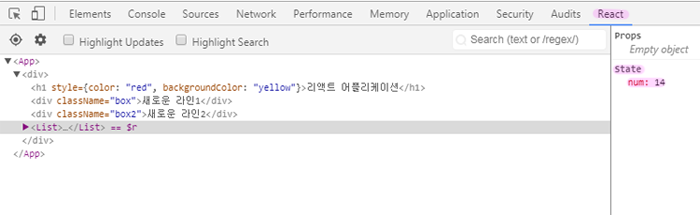
<br/>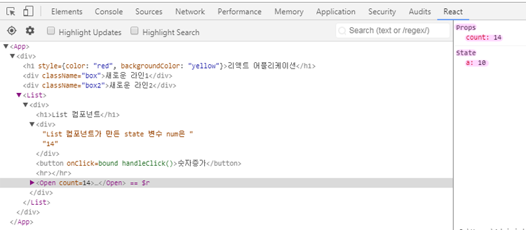
> 버튼을 클릭하면 각각 해당값이 변경됨

```
componentDidMount(){
  console.log('componentDidMount');
  this.setState({a:this.props.count});
}
```
- 결과
<br/>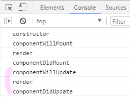
> 랜더링이 끝났는데 setState가 되면서 두번 랜더링됨

- this.setState({a:this.props.count}) 없을 때
<br/>

List.js
```
<Open count={num} upCount={this.handleClick.bind(this)}/>
```

Opne.js
```
<Close count={count} upCount={this.props.upCount}/>
```

Close.js
```
return (
  <div>
    <h1>Close 컴포넌트</h1>
    <div>상위 Open 컴포넌트가 전달해준 데이터는 {count}</div>
    <button onClick={this.props.upCount}>숫자증가</button>
  </div>
)
```
> Close 컴포넌트에도 숫자증가 버튼을 달아서 숫자가 1씩 증가시키는 동일한 기능을 넣어줌

## 적용3 - 토글버튼 달기
List.js
```
constructor(){
  super();
  this.state = {
    num : 10,
    show : false
  }
}
```
> Open컴포넌트와 Close컴포넌트 닫아두기
```
showClick(){
  this.setState({show:!this.state.show});
}
```
> ture 에서 false, false 에서 ture 로 토글기능을 넣어주기 위해 "!"를 사용
```
<button onClick={this.showClick.bind(this)}>토글버튼</button>
```
> 토글버튼 생성하고 기능넣어줌
```
{(this.state.show) ? <Open count={num} upCount={this.handleClick.bind(this)}/>:''}
```
> ture일때 하위 컴포넌트를 보여주고 false일때 '' 빈화면을 출력<br/>Open 컴포넌트만 제어해도 그 뒤는 알아서 제어가 됨 (false로 Opne을 닫았지만 Close도 닫힌 모습)

- `{() ? 참:거짓}`

```
{(this.state.show) && <Open count={num} upCount={this.handleClick.bind(this)}/>}
```
> 위에 코드를 연산자를 이용해 간결화해줌

- 이러한 기능을 통해 메뉴가 열렸다 닫히는 모습도 컴포넌트가 붙었다 안붙었다 하는 것으로 이해할 수 있음

- 결과

<br/>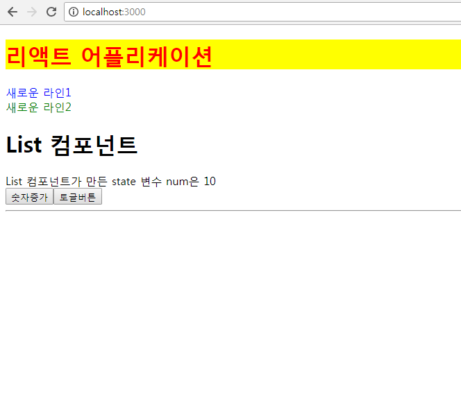
