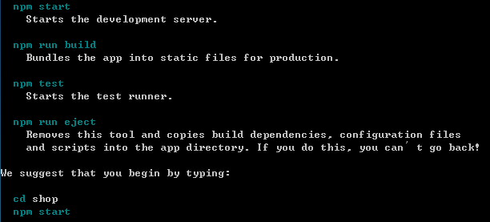
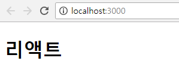
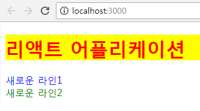
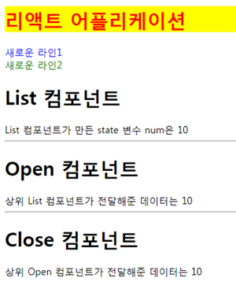

### react
## react 설치
- 프로젝트가 생성될 디렉토리에 전역으로 설치 (ex. downloads)
```
npm install create-react-app -g
```
> react를 설치하고 문법에 쉽게 접근가능하게 함
```
create-react-app shop
```
> shop(프로젝트명)으로 디렉토리를 생성하고 해당 폴더에 자동적으로 세팅해줌

<br/>
> 개발한 파일을 운영용으로 만들어줌<br/>코드가 동작하는지 테스트해줌<br/>커스터마이징을 할 수 있게 config 해줌
```
cd shop
```
> shop 디렉토리에 들어감
```
npm start
```
> locallhost:3000 으로 브라우저가 자동실행 됨(자동실행이 안될 경우 직접접속)<br/>packge.json에서 포트변경 가능<br/>이제부터 코드저장과 동시에 브라우저가 새로고침됨


## 세팅 된 디렉토리와 파일들
- react에서 시작점은 index.js
- react를 직접 세팅했다면 상관없지만 설치해서 사용하는 경우에는 반드시 index.js로 해야함
- 무조건 src폴더 안에서만 코드를 작성할 것

## public 디렉토리
- 정적(static)파일 폴더
- index.html 코드를 살펴보면 파일안에는 태그가 없음 즉, javascript로 태그를 전부 만들어줌

## src 디렉토리
### index.js
```
import React from 'react';
```
> react를 사용가능하게함<br/>ex6 문법으로 ex5 문법의 var React = require('react');와 같은 의미

- `import : javascript의 새로운 문법으로 ex6 문법으로 작성한 코드를 ex5 문법으로 바꿔줌`<br/>그래서 서버가 필요함 (노드를 자동으로 띄워주는 것)

```
import ReactDOM from 'react-dom';
```
> html에 붙여주는 코드

```
import App from './App';
```
> App.js(하나의 컴포넌트)를 index.js에 붙여줌 그러므로 사실적으로 시작점은 App.js 가 되는 것<br/>./ 는 일종의 약속

```
ReactDOM.render(<App />, document.getElementById('root'));
```
> jsx 문법으로 호출시 태그로 호출해야함<br/>App.js의 코드를 호출해 index.html에 id가 root인 태그안에 붙여줌

```
registerServiceWorker();
```
> 온라인이 끊겨도 사용할 수 있게 해주는 코드


#### 적용해보기
```
// import App from './App';

class App extends React.Component{
  render(){
    return <h1>클래스 리액트</h1>
  }
}
```
> App.js와 연결해주는 코드는 잠시 주석처리

- 결과

<br/>
> ex6는 class를 많이 사용함 class하나를 레고 한조각이라고 생각해라

- `extends : 상속받는다는 의미`
- `render : 화면에 그려주는 역할을 하는 메소드`

```
// import App from './App';

function App2(){
  return <h1>함수 리액트</h1>
}

ReactDOM.render(<App2 />, document.getElementById('root'));
```
> javascript에는 class가 없으므로 이렇게 함수로 사용가능 하지만 이 방법은 100% 활용되기 힘들기때문에 사용하지 않음

- 결과

<br/>

```
ReactDOM.render(<h1>리액트</h1>, 

document.getElementById('root'));
```
- 결과

<br/>


### App.js
- index.js가 App.js를 붙여주므로 import ReactDOM from 'react-dom' 코드는 필요없음
```
import React from 'react';
```
> react 사용
```
import './App.css';
```
> 파일자체를 연결시키므로 from이 필요없음

```
export default App;
```
> App.js이므로 App을 붙여줘야함 즉, App 컴포넌트를 내보낸다는 의미

#### 적용해보기
```
class App extends React.Component{
  render(){
    return <div>리액트 어플리케이션</div>
  }
}
```
> 화면에 '리액트 어플리케이션'이 출력됨

```
class App extends React.Component{
  render(){
    return (
      <div>
        <h1>리액트 어플리케이션</h1>
        <div>새로운 라인1</div>
        <div>새로운 라인2</div>
      </div>
    )
  }
}
```
> 여러개를 출력하고싶을때 반드시 return을 괄호로 묶어서 출력

- JSX 문법으로 컴포넌트는 하나만 받아서 리턴하기때문에 ()로 감싸줘야함

#### 1. CSS 직접 적용
```
class App extends React.Component{
  render(){
    let title = '리액트 어플리케이션'
    let styles = {
      color:'red',
      backgroundColor:'yellow'
    }
    return (
      <div>
        <h1 style={styles}>{title}</h1>
        <div>새로운 라인1</div>
        <div>새로운 라인2</div>
      </div>
    )
  }
}
```
> 직접 css를 작성하면 태그가 아니여서 오류가 나므로 변수 let에 작성해서 뿌려줌

- `react에서는 javascript의 예약어를 사용함`

- JSX 문법
	- `{} : 자바스크립트를 쓴다는 의미`
	- `{{}} : 객체임을 의미`

#### 2. CSS 외부파일 방식
- 개발자도구에서 코드의 위치를 찾을 수 없음 수정이 어려움

src\App.css
```
.box {color:blue;}
```
> App.js는 App.css에 css를 작성하는것처럼 이름을 묶어주면 편함

#### 3. CSS 정적파일 방식
- 개발자도구에서 코드의 위치를 찾을 수 있으므로 수정에 용이함 (추천)

public\style.css
```
.box2 {color:green;}
```
> src와 관련이 없기때문에 style.css 파일이 적용되려면 public\index.html에 선언을해서 css를 불러와야함

public\index.html
```
<link rel="stylesheet" href="%PUBLIC_URL%/style.css">
```

```
class App extends React.Component{
  render(){
    let title = '리액트 어플리케이션'
    let styles = {
      color:'red',
      backgroundColor:'yellow'
    }
    return (
      <div>
        <h1 style={styles}>{title}</h1>
        <div className="box">새로운 라인1</div>
        <div className="box2">새로운 라인2</div>
      </div>
    )
  }
}
```

- 결과

<br/><br/>

- CSS 적용은 정적파일을 이용하는것이 편리하며 요즘은 사스에서의 방식을 사용함

## (중요!) props 와 state 
- props : 상위 컴포넌트가 전달해주는 데이터(값)
- state : 자기자신 컴포넌트가 만든 데이터
> state가 변경되면 해당 컴포넌트는 render 메소드를 자동으로 다시 실행함
- react는 단방향 데이터 전송방식 (상→하 로만 가능)<br/>무조건 한 컴포넌트씩 (한 단계씩) 전달가능

## components 디렉토리
- src\components 디렉토리 생성
- 컴포넌트 폴더를 하나 만들어서 분리하는것이 좋음 (박스, 버튼 ...)
src\App.js
```
import List from './components/List';
```
> List를 가져옴 원하는 위치에 붙여줄 수 있음 (경로를 잘 확인할 것)
```
return (
  <div>
    <h1 style={styles}>{title}</h1>
    <div className="box">새로운 라인1</div>
    <div className="box2">새로운 라인2</div>
    <List />
  </div>
)
```
> 아래에 List를 붙여줌

### List.js
- 클래스로 사용할것이므로 첫글자를 대문자로 씀
```
import React from 'react';
class List extends React.Component{};
또는
import React, { Component } from 'react';
class List extends Component{};
```
> 리액트 선언부분에 component 기능을 먼저 빼오면 클래스선언 부분에서 React가 생략가능
```
import React, { Component } from 'react';
```
> 리액트 사용

```
export default List;
```
> List 컴포넌트 내보냄
```
class List extends Component{
  render(){
    let num = 10;
    return (
      <div>
        <h1>List 컴포넌트</h1>
	<div>List 컴포넌트가 만든 state 변수 num은 {num}</div>
      </div>
    )
  }
}
```
- 변수 num을 하위 컴포넌트에게 전달해보기
```
import Open from './Open';
```
> Open을 붙임
```
<Open count={num} />
```
> 변수 num을 count에 담아서 Open으로 넘김

### Open.js
```
import React, { Component } from 'react';
```
> react 선언
```
import Close from './Close';
```
> Close 붙임

```
class Open extends Component{
  render(){
    return (
      <div>
        <h1>Open 컴포넌트</h1>
        <div>상위 List 컴포넌트가 전달해준 데이터는 {this.props.count}</div>
        <hr />
        <Close count={this.props.count} />
      </div>
    )
  }
}
```
- 분석
```
{this.props.count}
```
> 내가 전달받은 count라는 값이 {count:10} 객체로 넘어옴

```
<Close count={this.props.count} />
```
> count를 다시 count에 담아서 Close에 전달

```
export default Open;
```
> 컴포넌트 내보내기

### Close.js
- 기본코드 생략
```
class Close extends Component{
  render(){
    return (
      <div>
        <h1>Close 컴포넌트</h1>
        <div>상위 Open 컴포넌트가 전달해준 데이터는 {this.props.count}</div>
      </div>
    )
  }
}
```
- 결과

<br/><br/>

- 코드 간결화

Open.js
```
render(){
  const {count} = this.props;
  return (
    <div>
      <h1>Open 컴포넌트</h1>
      <div>상위 List 컴포넌트가 전달해준 데이터는 {count}</div>
      <hr />
      <Close count={count} />
    </div>
  )
}
```
Close.js
```
render(){
  const {count} = this.props;
  return (
    <div>
      <h1>Close 컴포넌트</h1>
      <div>상위 Open 컴포넌트가 전달해준 데이터는 {count}</div>
    </div>
  )
}
```
> 변수 {count}를 이용해 코드를 간결하게 해줌
