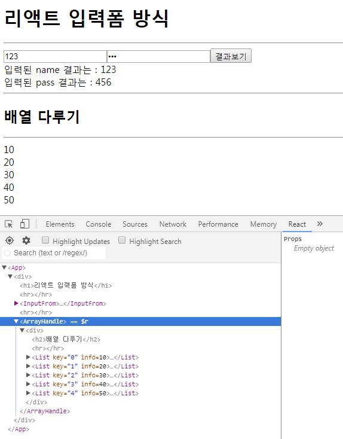

## Router
- 입력양식 폼

### 기본세팅
```
create-react-app four
```
```
cd four
```
```
npm start
```
> four(폴더명)으로 react 생성 후 폴더로 들어가 서버연결

### src
#### input 입력값 출력하기
- 폴더안에 모든 파일 삭제 후 시작
index.js
```
import React from 'react';
import ReactDOM from 'react-dom';
import App from './App';

ReactDOM.render(<App />, document.getElementById('root'));
```
App.js
```
import React from 'react';
import InputForm from './InputForm';

class App extends React.Component {
  render(){
    return (
      <div>
        <h1>리액트 입력폼 방식</h1>
        <hr />
        <InputForm />
        <hr />
      </div>
    )
  }
}

export default App;
```
InputForm.js
```
import React from 'react';

class InputFrom extends React.Component {
  state = {
    name : ''
  }

  handleClick(){
    console.log(this.data.value);
  }

  render(){
    return (
      <div>
        <input type="text" name="name" ref={ref=>this.data=ref} />
        <button>결과보기</button>
        <div onClick={this.handleClick.bind(this)}>입력된 name 결과는 : </div>
      </div>
    )
  }
}

export default InputFrom;
```
- 코드분석
```
state = {
  name : ''
}
```
> construtor를 직관적으로 표현한 코드

```
onClick={this.handleClick.bind(this)}
```
> bind에 인자로 전달된 this는 자신이 가진 메소드에 내 존재를 알려줌

```
ref={ref=>this.data=ref}
```
> ex6문법으로 ref={(ref)=>{return this.data=ref}} 과 같으며 한줄일때는 return이 생략가능하고 괄호가 하나일땐 괄호도 생략가능<br/>함수로 풀어쓰면 function(ref){return this.data=ref}와 같음

> {함수} 첫번째 들어오는 파라미터 (ref)는 자신이고 참조시키는 참조기능을 담은 자신을 this.data에 넣음 여기에서 this.data는 input을 가르킴<br/>변수 var와 같지만 this를 쓴 이유는 class 안에서 공유하기 위함

- `ref : 참조 / 레퍼런스 방식으로 태그에 이름을 부여함`<br/>ref는 스크롤이벤트와 같은때나 사용되고 거의 사용하지 않음

```
handleClick(){
  console.log(this.data.value);
}
```
> 입력한 값을 자바스크립트에서 value를 꺼내와 버튼을 누르면 콘솔창에 해당값을 찍어줌
```
handleClick(){
  this.data.classList.add('asd');
}
```
> this.data를 이런식으로도 사용이 가능<br/>버튼을 클릭하면 asd 클래스가 input에 생성됨

> 즉, this.data는 $(''), document.getElementById('')와 같은 역할을 하게되는 것

- input의 값 출력하기

```
handleClick(){
  this.setState({name:this.data.value});
}
```
> 버튼을 누르면 state에 해당 입력값을 가져와 세팅함
```
<div>입력된 name 결과는 : {this.state.name}</div>
```
> 세팅된 값은 이곳에 뿌려줌 즉, 버튼을 누르면 입력한 값이 해당위치에 출력됨

- input의 값이 변경될때마다 실행되는 이벤트
```
<input type="text" name="name" ref={ref=>this.data=ref} onChange={this.handleChange.bind(this)} />
```
> onChange 추가
```
handleChange(){
  console.log('a');
}
```
> input에 값을 입력할때마다 콘솔창에 a가 찍힘
```
handleChange(){
  this.setState({name:this.data.value});
}
```
> input에 값을 입력할때마다 해당 값이 아래에 출력됨
```
handleChange(e){
  this.setState({name:e.target.value});
}
```
> 클릭 이벤트 정보로 가지고온 해당 벨류값을 name의 value로 세팅하는 방식
```
handleChange(e){
  this.setState({[e.target.name] : e.target.value});
}
```
> 변수를 key값으로 할 수 없기때문에 key값도 변수로 쓰려면 대괄호로 묶어서 사용

> 이러한 점들은 state의 name과 key값이 일치해야만 가능함

- password 추가
```
state = {
  name : '',
  pass : ''
}
```
```
<input type="password" name="pass" onChange={this.handleChange.bind(this)} value={this.state.pass} />
```
> value={} 부분은 현재는 오류가 안나기때문에 생략가능
```
<div>입력된 pass 결과는 : {this.state.pass}</div>
```

#### 배열다루기
App.js
```
import ArrayHandle from './ArrayHandle';
```
```
<ArrayHandle />
```
> ArrayHandle 코드 추가
ArrayHandle.js
```
import React from 'react';

class ArrayHandle extends React.Component {
  render (){
    let number = [<div>10</div>, 20, 30];
    return (
      <div>
        <h2>배열 다루기</h2>
        <hr />
	{number}
      </div>
    )
  }
}
export default ArrayHandle;
```
> 첫번째 배열만 출력하고싶다면 {number[0]}을 이용

> 배열에 태그가 들어가면 오류가 뜨므로 반드시 태그마다 키값이 필요하다. 
```
let number = [
  <div key="1">10</div>,
  <div key="2">20</div>,
  <div key="3">30</div>
]
```
> 이 방법은 배열의 갯수가 정해져있어 확장성이 없으므로 잘 쓰지않음

- 태그가 들어가는 순간 JSX문법이 되고 숫자만 들어가게 된다. 그냥 데이터가 되기때문에 키값은 중복이 되지않게 유니크해야한다. 즉, 키값을 index로 하게되면 절대 겹칠일이 없다. value는 다소 위험하다.<br/>키값은 반드시 맨 첫번째 태그에 부여해야하며 키값을 확인할땐 react 도구에서 봐야한다.

## Map / Filter
- 기존 배열을 통해 새로운 배열을 만듬
- 보통 랜더링을 해주는 것은 map
- map
  - 기존의 배열 갯수만큼 실행해 리턴값을 반환(기존의 배열 갯수가 5개면 새로 만든 배열도 5개)
  - 리스트를 출력할때 주로 사용
- filter
  - 리턴값을 걸러줌(기존의 배열 갯수 이하)
  - 카테고리를 나눌때 주로 사용
```
let num = [10, 20, 30, 40, 50];
```
```
let result = num.map((value, index)=>{
 return 10;  // 10 10 10 10 10
});
```
> 기존의 배열이 5개라서 5번 실행되어 리턴의 값인 10을 5번 반환함

- `map은 기본적으로 매개변수(파라미터) 두개를 제공함`

```
{result}
```
> {result} 대신 직접 {코드}를 넣어도 됨
```
let result = num.map((value, index)=>{
 return value;  // 10 20 30 40 50
});
```
> value값 출력
```
return index;  // 0 1 2 3 4
```
```
return value*2;  // 20 40 60 80 100
```
```
return value > 20;  // X
```
```
return <div key={index}>{value*2}</div>;
```
- 결과
```
20
40
60
80
100
```
```
return (
  <div key={index}>
    <div>{value*2}</div>
  </div>
);
```
> 멀티라인으로 묶었을 경우 첫번째 태그에 key값 부여함 결과는 위와 같음

```
{result1}
```
```
let result1 = num.filter((value, index)=>{
  return value*2;  // 10 20 30 40 50
});
```
> 리턴의 조건의 값을 반환하지 않는것으로 걸러줄 애들이 없으므로 그냥 다 출력시킴
```
return value > 20;  // 30 40 50
```
> 20보다 큰 값들을 반환


## 함수형 컴포넌트
- 컴포넌트는 smart(클래스형 컴포넌트)와 domb(함수형 컴포넌트)로 나뉨
- 함수형 컴포넌트는 state를 만들 수 없고 lifecycle이 없으므로 오직 view만 그리기위해서 사용됨
- props만 사용가능 즉, 데이터를 받는것만 가능함

List.js
```
import React from 'react';

const List = (props) => {
  return (
    <div>{props.info}</div>
  )
}

export default List;
```
> 함수로써 파라미터를 받은것이므로 this가 필요없음

```
const List = ({info}) => {
  return (
    <div>{info}</div>
  )
}
```
> 비구조적 할당 방식

ArrayHandle.js
```
import List from './List';
```
```
let result = num.map((value, index)=><List key={index} info={value} />);
```
> 아까의 코드를 컴포넌트방식으로 사용한 것으로 한줄이므로 return 생략<br/>props를 받아쳐주기위해 데이터를 넘겨줌<br/>key값은 컴포넌트에 붙이지만 만약 div로 감싸져있다면 첫번째 태그인 그 div에 key값을 넣어야함<br/>이것이 뿌려주는 모든것들에 key값이 붙고 이것은 개발자 도구의 react 도구에서 확인가능

- 최종 결과

<br/><br/>

### 기타
- 키값을 변수로 쓸 수 있음
```
var a = {b:10, c:20}
var c = 'b'
a[c];  // 10
```
- 새로운 ex6 문법 (예약어)
```
var a = {b:10, c:20}
{...a, d:30}         // {b:10, c:20, d:30}
a.b                  // 10
a.c                  // 20
var {b, c} = a
b                    // 10
c                    // 20
```
- 함수의 ex6 문법
```
function name(a){
  return a * a;
}
```
```
let name = a => a * a
```
> 같은 코드
