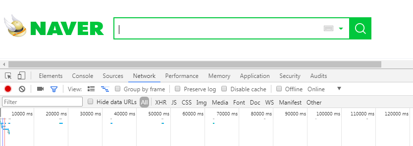
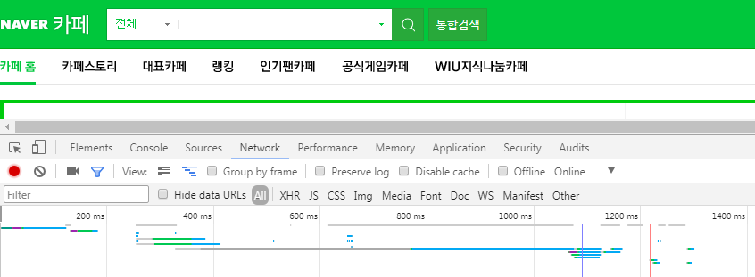
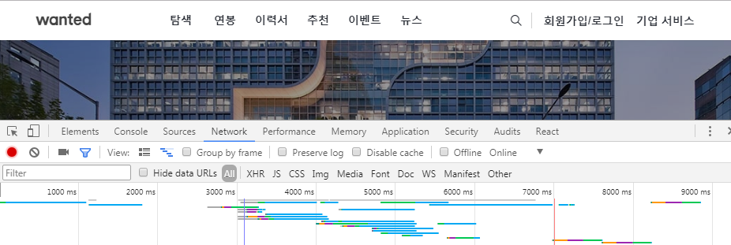
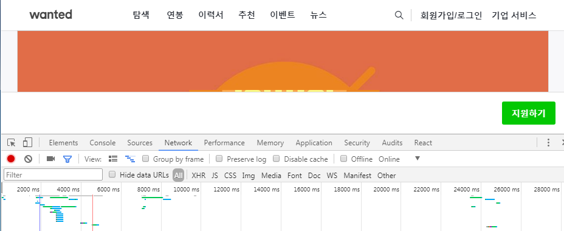
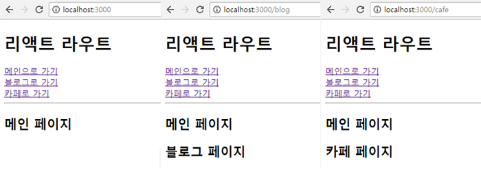
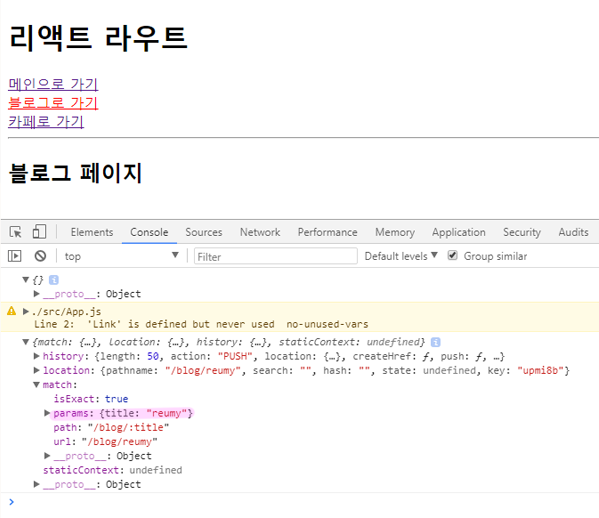

## 싱글페이지
- 창이 새로고침 되지않는 페이지
- 특히 모바일에 적합
- Ajax 통신 (실시간 통신)
- 하나에 화면에 새로운 페이지를 계속 다시 그려줌
- 싱글페이지도 주소 뒤에가 바뀜 이것은 갈래길일 뿐임
- 갈림길을 지정해주는 것이 라우트 <Route />
  - path는 경로를 의미하며 포트(3000)뒤를 말함<br/>localhost:3000(/) 생략되어있는 상태
- 원페이지는 뒤로가기가 되지않음
  - history API 이용해 해결

### 싱글페이지의 문제점
- 실시간으로 화면이 유지 즉, 내부적으로 계속 통신중이기 때문에 더블클릭과 같은 개념에 있어서 위험이 있음
> 팝업을 레이어로 띄워 뒷부분은 까맣게 처리하여 동작할 수 없게 하거나 한번 클릭하면 버튼이 사라지게 하는 등의 막아주는 개념을 해주어야함
- 이러한 해결방안은 모바일에서는 100% 가능하지만 웹에서는 한계가 있음<br/>웹에서는 그 사람이 해당 웹을 사용하고있는지 켜두고 다른 작업을 하고있는지를 모르기때문
> 그래서 결제와 같은 작업을 하는 도중에 웹을 꺼버린다던지 등의 많은 예외의 경우를 전부 생각해줘야함


### 서버사이드 vs 싱글페이지
- 서버사이드 : 네이버
<br><br/>
> 새로운 페이지 접속 시 새로고침이 되면서 0부터 다시 시작됨
- 싱글페이지 : 원티드
<br><br/>
> 새로운 페이지 접속 시 새로고침이 되지않고 0부터 다시 시작되지않고 뒤에 계속 추가가됨


## 싱글페이지 제작
- html 하나, 하나의 페이지, 하나의 div
```
create-react-app router
```
```
cd router
```
```
npm install react-router-dom --save
```
> 리액트 라우터 설치

- src 파일 싹 지우고 시작
index.js
```
import React from 'react';
import ReactDOM from 'react-dom';
import App from './App';

ReactDOM.render(<App />, document.getElementById('root'));
```
App.js
```
import React from 'react';

class App extends React.Component {
  render(){
    return (
      <div>
        <h1>리액트 라우트</h1>
        <a href="/">메인으로 가기</a><br />
        <a href="/blog">블로그로 가기</a><br />
        <a href="/cafe">카페로 가기</a><br />
      </div>
    )
  }
}

export default App;
```
> a 태그는 하이퍼링크 개념이라서 전달해주는 링크로 새로고침이 됨

- a 태그 대신 리액트 라우터가 제공하는 컴포넌트를 사용함
```
import {BrowserRouter as Router, Link} from 'react-router-dom';

class App extends React.Component {
  render(){
    return (
      <Router>
        <div>
          <h1>리액트 라우트</h1>
          <Link to="/">메인으로 가기</Link><br />
          <Link to="/blog">블로그로 가기</Link><br />
          <Link to="/cafe">카페로 가기</Link><br />
      </div>
      <Router>
    )
  }
}
```
- 코드분석
```
import Router from 'react-router-dom';
```
> 리액트 라우터의 모든 기능이 들어온다는 선언
```
import {BrowserRouter as Router} from 'react-router-dom';
```
> 위 코드의 비구조 할당 방식
```
import {BrowserRouter as Router, Link} from 'react-router-dom';
```
> 앞에있는 이름(BrowserRouter)을 뒤에있는 이름(Router, Link)으로 쓰겠다는 의미의 별칭
```
<Router>...</Router>
```
> 라우터로 감싸줌
```
<Link to="">...</Link>
```
> JSX 문법은 모든 태그는 닫아줘야하고 속성을 꼭 넣어줘야함 (img는 alt...) 즉, 접근성을 맞춰줘야 함

- 개발자도구로 확인해보면 a 태그로 보여짐 실제로는 a 태그지만 내부적으로는 Link로 돌아가고 있는 것

> B를 지우고 C로 새로 그릴때, C에게 B를 제공해주는 기능을 Link가 알아서 해줌

```
import Main from './Main';
import Blog from './Blog';
import Cafe from './Cafe';

<Router>
  <div>
    <h1>리액트 라우트</h1>
    <Link to="/">메인으로 가기</Link><br />
    <Link to="/blog">블로그로 가기</Link><br />
    <Link to="/cafe">카페로 가기</Link><br />
    <Route path="/" component={Main} />
    <Route path="/blog" component={Blog} />
    <Route path="/cafe" component={Cafe} />
  </div>
<Router>
```
Main.js
```
import React from 'react';

class Main extends React.Component {
  render(){
    return (
      <div>
        <h2>메인 페이지</h2>
      </div>
    )
  }
}

export default Main;
```
Blog.js
```
import React from 'react';

class Blog extends React.Component {
  render(){
    return (
      <div>
        <h2>블로그 페이지</h2>
      </div>
    )
  }
}

export default Blog;
```
Cafe.js
```
import React from 'react';

class Cafe extends React.Component {
  render(){
    return (
      <div>
        <h2>카페 페이지</h2>
      </div>
    )
  }
}

export default Cafe;
```
- 결과

<br/>
> 다른 페이지에 접속해도 메인 페이지가 계속 보이는 이유는 "/"일때 메인 페이지가 보이도록 해놨기 때문에 /blog와 /cafe로 접속해도 "/"가 포함되어 있어서 메인 페이지를 계속 출력하는 것<br/>exact를 이용해 해결

- `exact : 하위개념이 성립할때만 출력시킴`
```
<Route exact path="/" component={Main} />
```

### NavLink
- active 개념이 사용가능한 Link
- 클릭하는 태그에 active 클래스가 붙음 해당 태그를 제외한 나머지 태그의 active 클래스는 지워짐
- `active : 자바스크립트에서 실시간으로 선택한 대상을 제외한 나머지는 지워지고 해당 대상에만 지정되는 개념`
```
<NavLink exact to="/">메인으로 가기</NavLink><br />
```
> 여기에도 exact를 붙여주어야 함<br/>"/"가 붙은 모든 링크에 접속시 여기에는 계속 active가 붙기때문에 exact를 붙여줘야 같이 붙지 않음
```
activeClassName="클래스명"
```
> 원하는 태그안에 넣어주면 클릭시, 해당 태그에는 active 대신 부여한 클래스명으로 붙음

- NavLink 부분도 컴포넌트로 분리할 수 있음 대신, 사용하는 곳마다 import react-router 부분을 넣어 계속 호출을 해주어야함
```
import './App.css';
```
App.css
```
a.active{color:red;}
```
> 클릭하는 대상에만 글씨가 빨간색이 됨

### :title
- 변수명이 타이틀인 것
App.js
```
render(){
  console.log(this.props);  // {}
  return (
    <Router>
    ...
    <Route path="/blog/:title" component={Blog} />
    </Router>
  )
}
```
Blog.js
```
render(){
  console.log(this.props);
}
```
```
localhost:3000/blog/reumy
```
- 결과

<br/>
> params title이 reumy로 들어옴 (reumy도 blog안에 있기때문에 blog의 하위개념)

```
console.log(this.props.match.params.title);  // reumy
```
```
<h2>{this.props.match.params.title}블로그 페이지</h2>
```
App.js
```
<NavLink to="/blog/reumy">블로그로 가기</NavLink>
```
> '블로그로 가기' 버튼을 누를때마다 'reumy블로그 페이지'가 출력 됨


## history
- 이동경로
- 어떤식으로 해당 페이지에 들어왔는지를 배열로 쌓아둠
- 스텍은 밑에서부터 쌓지만 뒤로가기를 할때는 뒤에서부터 빠짐
- 채팅는 큐 방식, 히스토리는 스텍 방식
```
match : uri(주소랑 관련) 관련
location : 현재 위치 (현재의 url)
push : 클릭해서 가는 것
pop : 뒤로가기해서 가는 것
```
> history가 이러한 것들을 관리해줌 (개발자도구에서 확인가능)

Blog.js
```
<button onClick={this.handleClick.bind(this)}>메인으로 돌아가기</button>
```
```
handleClick(){
  this.props.history.push('/');
}
```
> 블로그에서 메인으로 갔다는 히스토리를 쌓아주어야 뒤로가기를 할 수 있음<br/>이 코드가 없으면 Ajax는 뒤로가기가 안됨

- 그냥 뒤로가기는 브라우저에서 뒤로가는 것으로 하이퍼링크의 역순으로 10인 상태에서 뒤로 갔다오면 0으로 바뀜
- 싱글페이지에서 코드를 작성해 뒤로가면 전에 작업한 페이지로 돌아가는 것으로 10인 상태에서 뒤로 갔다오면 다시 변경했던 상태인 10 그대로인 것 스크롤도 그대로 있음

> 원티드 경우 밑으로 내려갈때마다 데이터가 생기는데 이것도 뒤로갔을때 다시 다운받지도 않음

> 서버사이드에서 스크롤의 위치를 그대로 두는 기능은 trangition을 다시 실행한다던가 하는 방식으로 동일하게 처리는 가능


- `push : 곧 거기로 감, 이동시켜 줌`


### Redirect
- 다른데로 보냄
Cafe.js
```
import {Redirect} from 'react-router-dom';
```
```
<Redirect to="/" />
```
> cafe에 접속할때마다 메인으로 튕겨내버림
```
state = {
  logged : true
}
```
```
{this.state.logged && <Redirect to="/" />}
```
> true일때 이동시키고 false일때 이동시키지않음
```
{!this.state.logged && <Redirect to="/" />}
```
> 이런식으로 이용해서 로그인이 안되면 리다이렉트로 튕겨내고 로그인이 되면 리다이렉트가 안되도록 기능을 넣을 수 있음

- 싱글페이지를 이용하면 html하나로 여러개의 페이지를 그려낼 수 있음

### 기타
- `<Route path="/" render={()=><div>asdf</div>} />` 이렇게도 사용하지만 잘 사용하지 않음
- render 먼저 시작되는건 constructor 뿐
- react-router를 사용하다가 이유없이 안될땐 서버를 다시 끊고 재시작
