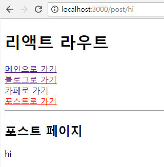

## Switch
App.js
```
import Post from './Post';
```
```
<NavLink to="/post">포스트로 가기</NavLink><br />
```
```
<Route path="/post" component={Post} />
```
> 포스트 페이지 추가, 연결

Post.js
```
import React from 'react';
import {Route, Link} from 'react-router-dom';

const Content = (props) => {  // 함수형 컴포넌트
  return (
    <div>{props.match.params.title}</div>
  )
}

class Post extends React.Component {
  render (){
    return (
      <div>
        <h2>포스트 페이지</h2>
        <Route path="/post/:title" component={Content} />
      </div>
    )
  }
}

export default Post;
```
- 접속
```
locallhost:3000/post/hi
```
- 결과

<br/>
> /post/hi 로 접속시 hi가 출력됨

App.js
```
import {BrowserRouter as Router, Route, Link, NavLink, Switch} from 'react-router-dom';
```
```
class App extends React.Component {
  render(){
    console.log(this.props);
    return (
      <Router>
        <div>
          <h1>리액트 라우트</h1>
          <NavLink to="/">메인으로 가기</NavLink><br />
          <NavLink to="/blog/reumy">블로그로 가기</NavLink><br />
          <NavLink to="/cafe">카페로 가기</NavLink><br />
          <NavLink to="/post">포스트로 가기</NavLink><br />			
          <hr />
          <Switch>
            <Route exact path="/" component={Main} />
            <Route path="/blog/:title" component={Blog} />
            <Route path="/cafe" component={Cafe} />
            <Route path="/post" component={Post} />
          </Switch>
        </div>
      </Router>
    )
  }
}
```
> Switch는 감싼것중에서 처음에 걸리면 다음꺼를 읽지않으므로 exact 기능이 필요가 없어짐

Post.js
```
class Post extends React.Component {
  render (){
    return (
      <div>
        <h2>포스트 페이지</h2>
        <Link to="/post/html">HTML5</Link><br />
        <Link to="/post/css">CSS</Link><br />
        <Link to="/post/js">JavaScript</Link><br />	
        <Route path="/post/:title" component={Content} />
      </div>
    )
  }
}
```
> 클릭한 링크에 해당하는 주소의 값(/post/*)이 들어옴<br/>HTML5 클릭하면 html, CSS 클릭하면 css, JavaScript 클릭하면 js

App.js
```
<Route render={()=><div>페이지 없음</div>} />
```
> Switch안에 넣어주면 없는 링크로 접속했을 때 마지막 라우트인 위에 코드를 그려줌

- 결과

<br/>
> 해당 링크에 걸리는 페이지가 없으므로 마지막 라우트인 페이지 없음(404)를 띄워줌<br/>직접 url을 치고 들어오는 사람들 중 잘못들어오는 페이지를 막아줄 수 있음

### TIP
- 라우터안에서 라우터를 계속 추가할 수 있음
- 컴포넌트를 분리하면 관리가 편해짐
- 코드를 작성할때 component를 안쓰고 바로 render로 해도 되지만 태그를 다 달아줘야하는 귀찮음이 있으므로 컴포넌트를 이용하자

