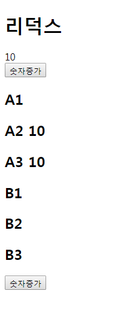
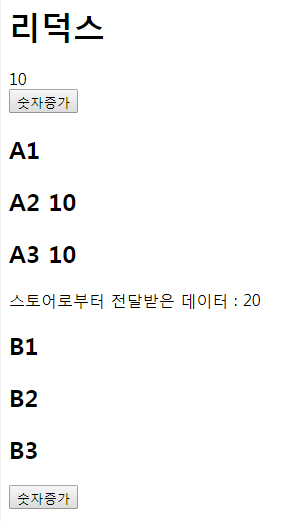
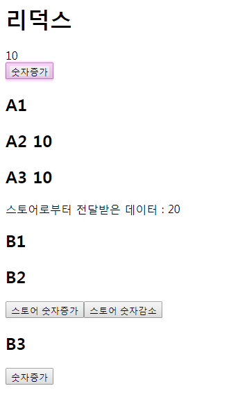

- MVC → MV** : 개발패턴방법 (공부필요)
- Flux : 리액트에서 MVC가 안맞아서 페이스북에서 만든 것 (멀티스토어)

## Redux
- 단일 스토어 : 하나의 스토어에서 모든것을 관리함
- 데이터를 관리하는 패키지
- 리덕스는 별개로 스토어 개념이라서 일반 html 등에서도 사용이 가능함
- Flux보다 관리에 용이함
- 큰 틀은 class가 하고 리덕스가 들어가면 거의 함수형 컴포넌트로 개발함
- 리덕스에서 전달받은것은 무조건 props로 받음
- `redux devtools : 리덕스 확인 도구`<br/>크롬 웹스토어에서 확장프로그램으로 다운 후 선언해주어 사용

> ex) 이마트 : store / 음식, 주류 등 : reducers

- 공통적으로 가지고 있어야할 것들은 store에 넣고 (로그인 정보 등), 남이 사용하는 것 까지는 store에 넣어 둘 필요없음 (개인정보 등)
- 스토어에 뭘 넣을지와 폴더의 구조는 취향에 따라 다름 즉, 본인판단


### 중요한 네가지 개념
- store : 자료
- actions : 이벤트 (유저가하는 행동들로 일어나는 일들)
- reducers : 스토어의 연결 (현재상태를 가지고있음)
- dispatch : actions와 reducers를 연결해주는 고리 (actions → reducers)

### 루팅이 짜여지는 순서
1. 유저가 UI를 봄
2. 숫자증가 버튼을 보고 버튼을 클릭 (actions)
3. dispatch를 통해서
4. reducers가 해당 이벤트에 맞는것을
5. store에서 찾아서
6. state 해서
7. UI로 보내줌

- 미들웨어가 사용될시에는 dispatch(3)와 reducers(4)사이에서 작동함

> 스토어안에 reducers가 있고 reducers가 어떤 기능을하면 store가 그 기능을 받음

#### React
- 리액트는 단 방향이라서 올릴 수 없고 최상위만 관여할 수 있어서 복잡해지면 어려워짐
- Angularjs 양방향 / React : 단방향
- 오타나 에러가나면 역추적을 해야하는 불편함
- 소규모 어플리케이션에서는 리액트로만 구현이 가능
- 재랜더링 시 무조건 하위들만 재랜더링해줌 위에는 불가능
- 리액트는 부분만 적용이 가능
> 네이버는 메일만 react를 적용함
```
script type 으로 선언하고 \<div id=root\> 만 넣으면 적용 됨
```

### 구현해야할 것
- ui → reducers → store → state → ui
- B3에서 버튼을 누르면 A2에 있는 숫자가 바뀌게할 것
- A2 데이터(number)의 값(10)을 B3 펑션에서 조작할때 스토어에 전달해 스토어에서 A2에 전달해주고 A2 하위의 것들에게 재랜더링을 해줄 것
- 데이터를 스토어에서 전부 관리

```
create-react-app redux-project
```
> 디렉토리명 redeux-project으로 리액트 설치 (리덕스 기본개념 세팅)
```
cd redux-project
```
```
npm install --save redux
```
> 리덕스 설치
```
npm start
```
> src 폴더안 파일 전부삭제

### 페이지 세팅
index.js
```
import React from 'react';
import ReactDOM from 'react-dom';
import App from './App';

ReactDOM.render(<App />, document.getElementById('root'));
```
App.js
```
import React from 'react';
import A1 from './A1';
import B1 from './B1';

class App extends React.Component {

  state = {
    number : 10
  }

  handleClick(){
    this.setState({number:this.state.number + 1});
  }

  render(){
    return (
      <div>
        <h1>리덕스</h1>
        <div>{this.state.number}</div>
        <button onClick={this.handleClick.bind(this)}>숫자증가</button>
        <A1 num={this.state.number} />
        <B1 btn={this.handleClick.bind(this)} />
      </div>
    )
  }
}

export default App;
```
A1.js
```
import React from 'react';
import A2 from './A2';

class A1 extends React.Component {
  render (){
    return (
      <div>
        <h2>A1</h2>
        <A2 num={this.props.num} />
      </div>
    )
  }
}

export default A1;
```
A2.js
```
import React from 'react';
import A3 from './A3';

class A2 extends React.Component {
  render (){
    return (
      <div>
        <h2>A2 {this.props.num}</h2>
        <A3 num={this.props.num} />
      </div>
    )
  }
}

export default A2;
```
A3.js
```
import React from 'react';

class A3 extends React.Component {
  render (){
    return (
      <div>
        <h2>A3 {this.props.num}</h2>
      </div>
    )
  }
}

export default A3;
```
B1.js
```
import React from 'react';
import B2 from './B2';

class B1 extends React.Component {
  render (){
    return (
      <div>
        <h2>B1</h2>
        <B2 btn={this.props.btn} />
      </div>
    )
  }
}

export default B1;
```
B2.js
```
import React from 'react';
import B3 from './B3';

class B2 extends React.Component {
  render (){
    return (
      <div>
        <h2>B2</h2>
        <B3 btn={this.props.btn} />
      </div>
    )
  }
}

export default B2;
```
B3.js
```
import React from 'react';

class B3 extends React.Component {
  render (){
    return (
      <div>
        <h2>B3</h2>
        <button onClick={this.props.btn}>숫자증가</button>
      </div>
    )
  }
}

export default B3;
```
- 결과

<br/>
> 숫자증가 버튼을 누르면 숫자가 증가함


### reducers (디렉토리 생성)
- 컴포넌트가 아니기때문에 파일명을 소문자로 써도됨
- 야채코너, 과일코너 같은 것
- 무조건 객체형태로 제작이 되어야함

number.js
```
import {combineReducers} from 'redux';
```
> 모든 reducers를 모아줌
```
const initialState = {
  count : 20,
  a : 30
}
```
> 반드시 객체형태여야 함<br/>count는 우리가 사용할 데이터이고 a는 임시로 만들어놓은 불필요한 데이터
```
const control = (state=initialState, action) => {
  return state;
}
```
> initialState를 state로 가지고 있음
```
const reducers = combineReducers({
  control
})
```
> control : control ex6 문법에서는 키와 벨류값이 같을때 한번만 써줘도 됨 즉, control만 써도 가능
```
export default reducers;
```
> reducers로 내보냄 받을땐 import로 받아주면 됨<br/>스토어가 있는데까지 가서 스토어에 넣어줘야 함

index.js
```
import {createStore} from 'redux';
```
> 리덕스 세팅 / store를 만들어주는 메소드
```
import reducers from './reducers/number';
```
> reducers를 받음, reducers가 number를 스토어에 등록함 / 이것을 스토어가 있는곳으로 와서 스토어에 넣어줘야 함
```
import {Provider} from 'react-redux';
```
> 리액트에 리덕스를 붙임, 연결할 수 있게 해줌
```
const store = createStore(reducers);
```
> reducers 등록 / 스토어가 만들어짐
```
ReactDOM.render(
  <Provider store={store}>
    <App />
  </Provider>, document.getElementById('root'));
```
> 전체 즉, 모든 컴포넌트들이 store를 사용하기위해 \<App /\>에 감싸줌<br/>일부분에만도 사용가능

- 현재 환경이 단일 파일이라서 다른 파일을 combine으로 묶을 수 없으므로 나머지를 export 시켜서 index.js에 컴바인으로 묶음

A2.js
```
import {connect} from 'react-redux';
```
> 스토어랑 연결해줌
```
<div>스토어로부터 전달받은 데이터 : {this.props.open}</div>
```
```
const mapStateToProps = (state) => {
  return {
    open : state.control.count
  }
}
```
> 여기 state는 reducers에 initialState가 가지고있는 state를 말함<br/>그 중 control 안에 count(20) 데이터를 가지고 옴
```
export default connect(mapStateToProps,null)(A2);
```
> state를 props로 받아 사용한다는 뜻

- `connect : 기본파라미터 2개 제공<br/>첫번째 파라미터는 state / 두번째 파라미터는 action(dispatch)`

- 결과

<br/>
> {this.props.open}을 통해 number의 count 값 20을 받음


### actions (디렉토리 생성)
counting.js
```
export const INCREMENT = "INCREMENT";
export const DECREMENT = "DECREMENT";
```
> 액션의 타입

> reducers가 사용할 부분으로 reducers에게 어떤 액션인지 판별해주기 위해서만 전달해주는 용도<br/>해당 타입에 맞게 리듀서스가 증가시킬지 감소시킬지를 결정할때 사용

- `const(상수) : 대부분 대문자로 사용`

```
export function increase(){
  return {
    type : INCREMENT
  }
}

export function decrease(){
  return {
    type : DECREMENT
  }
}
```
> dispatch가 사용하기 위한 것

- 이 파일에 export default 가 생략된 이유는 단일로 나갈때만 사용하기 때문

number.js
```
import {INCREMENT, DECREMENT} from '../actions/counting';
```
```
const control = (state=initialState, action) => {
  
  //console.log(action.type);

  switch(action.type){
    case INCREMENT :
      return {...state, count : state.count + 1};
    case DECREMENT :
      return {...state, count : state.count - 1};
    default :
      return state;
  }
}
```
- 코드분석
```
const control = (state=initialState, action) => {...}
```
> 변형시킬 count(20)을 가지고 있어야하기 때문에 state를 가지고 있어야함

> dispatch를 이용해 액션이 여기로 넘어옴 (액션은 리듀서스랑 연결되어있기 때문)

```
case INCREMENT : ...
case DECREMENT : ...
```
> 이미 counting.js 에서 문자로 (export const INCREMENT = "INCREMENT") 가져왔기 때문에 ''를 써주지 않음
```
return {...state, count : state.count ...};
```
> 기존 state를 일단 전체복사 후 그 중에 count만 사용

- `...state : 기존 state를 전체 붙여주는 것으로 불변성을 지키는 행동`

```
default : return state;
```
> 보험 / 위에 타입이 아닌 경우 사용할때 쓰는 state 

B2.js
```
import {connect} from 'react-redux';
import {increase, decrease} from './actions/counting';
```
```
<button onClick={this.props.onIncreament}>스토어 숫자증가</button>
<button onClick={this.props.onDecreament}>스토어 숫자감소</button>
```
```
const mapDispatchToProps = (dispatch) => {
  return {
    onIncreament : () => {dispatch(increase())},
    onDecreament : () => {dispatch(decrease())}
  }
}

export default connect(null, mapDispatchToProps)(B2);
```

- 결과

<br/>
> 스토어 숫자증가, 감소 버튼을 누르면 스토어로부터 전달받은 데이터의 숫자가 변형됨

- action이 type을 가져오고 reducers가 state를 변경함

> action에서 게시판 5개를 가져오라고 버튼을 누르면 백엔드(서버-Ajax)에서 5개를 가져와 reducers에 주어 기존 state에 5개를 추가해줌

- `미들웨어 : 중간에 통신부분에서 작업, 관리하는 것`
- `thunc : 미들웨어 중 하나`
> 액션 뒤에 뭔가 필요할때 미들웨어를 이용


## build
- 호스팅에 등록
```
npm run build
```
> 해당 폴더안에 build 폴더가 생성되고 그 안에 자신이 만든 코드가 압축된 코드형태로 저장됨

- build 디렉토리를 메인으로 생각하고 안에 파일을 자신의 호스팅안에 넣으면 그대로 호스팅에서 출력이 가능

> 자신이 만든 react를 ex5문법의 css와 js의 코드로 변환시켜 만들어줌


### TIP
- 글로벌 설치 : 같은 드라이브안에서 전부 사용가능 (C드라이브에 설치하면 C드라이브 전체에서 사용가능 D드라이브에서는 사용 불가능)
- 리덕스를 이용하면 나에게 들어온 채팅, 알람 등의 숫자가 페이지를 이동해도 변경되거나 지워지지 않는 기능을 구현할 수 있음
