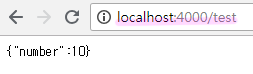
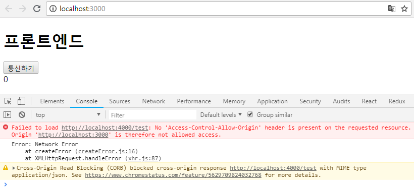
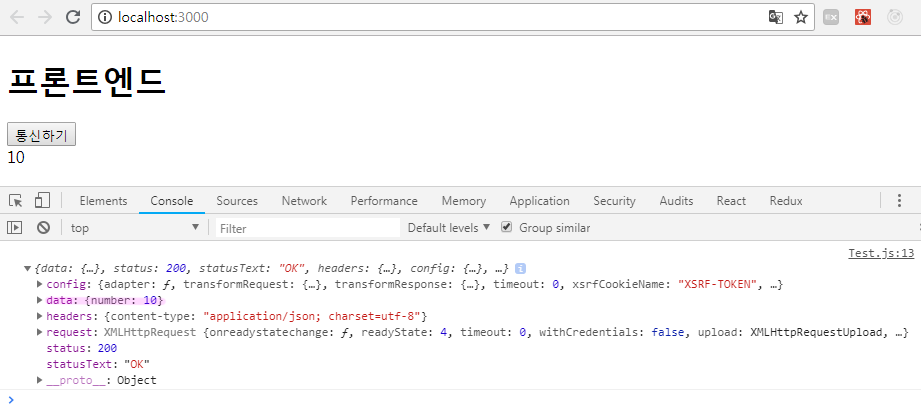
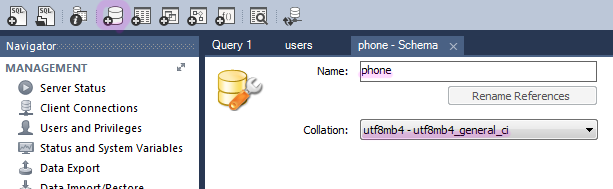
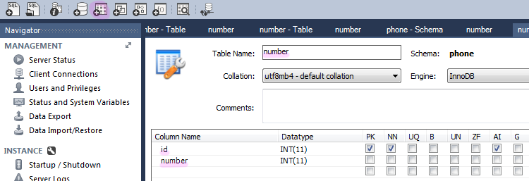
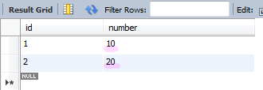
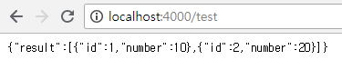
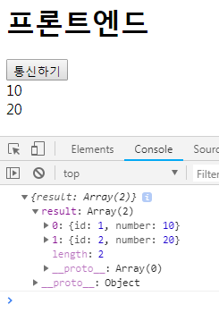
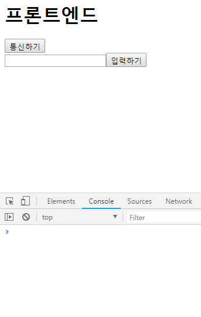

## 정보
- 프론트엔드
  - 3000 포트 사용
  - react
- 백엔드
  - 4000 포트 사용
  - node + express(프레임워크)
- 리액트는 입맛대로, 프레임워크는 정석
- 목표 : Rest API

### PORT
- 한 IP당 6500개 이상의 포트가 있음
- 건들면 안되는 포트들
- 80 : http
- 443 : https (http 암호화)
- 22 : ssh
- 21 : FTP
- 3306 : mysql


## 세팅

- 디렉토리 phone 생성
```
create-react-app frontend
```
> 디렉토리명 frontend 으로 리액트 설치
- backend 디렉토리 생성 후
```
npm init
```
```
npm install --save express
```
> init에 작성한 정보가 명세가 되어 그대로 설치 됨


- frontend/src/
App.js
```
import React, { Component } from 'react';

class App extends Component {
  render() {
    return (
      <div className="App">
        <h1>프론트엔드</h1>        
      </div>
    );
  }
}

export default App;
```
index.js
```
import React from 'react';
import ReactDOM from 'react-dom';
import App from './App';

ReactDOM.render(<App />, document.getElementById('root'));
```
```
npm start
```
> 프론트엔드 실행

- backend/
server.js
```
const express = require('express');
const app = express();
```
```
node server.js
```
> 백엔드 실행


## 서버와 통신하기

### backend
server.js
```
const express = require('express');
const app = express();

app.listen(4000,()=>console.log('웹서버 성공'));

app.get('/test',(req,res)=>{
  res.json({number:10});
});
```
- 코드분석
```
const app = express();
```
> app이 프레임워크 객체가 됨 (express의 기능이 다 들어감)
```
app.get('/test',(req,res)=>{
  res.json({number:10});
});
```
> 통신시점에서 가져오므로 여기를 변경하면 변경한 값으로 넘어옴
```
supervisor server.js
```
> 실행

- 결과

<br/>
> 프론트와 백의 코드가 서로 달라 사용할 수 없어서 state로 해준 것


### frontend
- 프론트가 백의 주소를 알아야 통신이 가능함
- (http)통신용 도구 axios를 사용
```
npm install --save axios
```
```
npm start
```
Test.js
```
import React, { Component } from 'react';
import axios from 'axios';

class Test extends Component {

  state = {
    number : 0
  }

  handleClick(){
    axios.get('http://localhost:4000/test')
      .then((response)=>{
        console.log(response);
      }).catch((error)=>{
        console.log(error);
      });
  }

  render(){
    return (
      <div>
        <button onClick={this.handleClick.bind(this)}>통신하기</button>
        <div>{this.state.number}</div>
      </div>
    )
  }
}

export default Test;
```
- 코드분석
```
state = {
  number : 0
}
```
> 초기값, 초기화 / number가 여기에 들어온다는 것을 알려줌

##### 초기화
- 숫자 : 0
- 문자 : ''
- 변수 : []

```
handleClick(){
  axios.get('http://localhost:4000/test')
    .then((response)=>{
      console.log(response);
    }).catch((error)=>{
      console.log(error);
    });
}
```
> get : 서버에서 get으로 가져왔으니 get으로 가져옴(서버에서 가져오는 방식에 따라 달라짐) / then : 성공했을 때 / catch : 실패했을 때


- 결과

<br/>
> 통신하기 버튼을 누르면 서버가 나에게 응답을 안해준다는 Access-control-allowtrigin 방화벽 에러가 뜸 cors를 이용해 해결
```
npm install cors --save
```
- `cors : 방화벽 해결 / 특정 ip를 막거나 가능하게하는 등의 기능을 해줌`

server.js
```
const cors = require('cors')();
```
> 실행시키면서 가져오는 방식으로 이용해봄
```
app.use(cors);
```
> 미들웨어로 등록, express 들어가기 전에 중간에 처리함

- 결과

<br/>
> 통신하기 버튼 누르면 console.log(response) 의 결과가 뿌려짐

```
handleClick(){
  axios.get('http://localhost:4000/test')
    .then((response)=>{
      console.log(response.data);
      this.setState({number:response.data.number});
    }).catch((error)=>{
      console.log(error);
    });
}
```
- 코드분석
```
this.setState({number:response.data.number});
```
> 통신할때 넘어옴
- 결과
```
{number : 10}
```

## DB(mysql) 연결하기

- DB 생성

<br/>
> phone 데이터베이스 생성

<br/>
> number 테이블 생성

<br/>
> 데이터 입력

- DB 연결
```
npm install mysql --save
```
server.js
```
const mysql = require('mysql');

const connection = mysql.createConnection({
  host : 'localhost',
  port : 3306,
  user : 'root',
  password : '****',
  database : 'phone'
});

connection.connect((err)=>{
  if (err) {
    console.log(err);
    return;
  }
  console.log('DB 연결 완료');
})
```
```
connection.query('SELECT * FROM number',(err,rows)=>{
  if (err) {
    console.log(err);
    return;
  }
  console.log(rows[0].number);  // 10
})
```
> 하나의 객체가 하나의 로우, 로우들이 모여 배열이 되어 로우들이 배열로 넘어옴 즉, mysql 결과는 다 배열로 넘어옴

```
app.get('/test',(req,res)=>{
  connection.query('SELECT * FROM number',(err,rows)=>{
    if (err) {
      console.log(err);
      return;
    }
    res.json({number:rows[0].number});
  })
})
```
> err : 에러 / rows : 결과

- 결과

<br/>
> DB의 첫번째 로우값을 가져옴

```
res.json({result : rows});
```
- 결과

<br/>
> 모든 로우값을 가져옴

Test.js
```
state = {
  number : 0,
  list : []
}

handleClick(){
  axios.get('http://localhost:4000/test')
    .then((response)=>{
      console.log(response.data);
      this.setState({list:response.data.result})
    }).catch((error)=>{
      console.log(error);
    });
}

render(){

  const {list} = this.state;
  const numberList = list.map((value)=>{
    return <div key={value.id}>{value.number}</div>
  })

  return (
    <div>
      <button onClick={this.handleClick.bind(this)}>통신하기</button>
      <div>{numberList}</div>
    </div>
  )
}
```
- 코드분석
```
ist : []
```
> 버튼을 누르면 여기에 담김

```
this.setState({list:response.data.result})
```
> number로 넘어올게 아니므로 이렇게 작성함<br/> response.data == res.json({result:rows})
```
<div key={value.id}>{value.number}</div>
```
> key는 반드시 들어와야하고 유니크해야하므로 id를 사용함

- 결과

<br/>
> 통신하기 버튼을 누르면 아래에 DB값이 뿌려짐


### 프론트에서 DB 추가하기
```
<input type="text" onChange={this.handleChange.bind(this)} />
<button onClick={this.submitClick.bind(this)}>입력하기</button>
```
```
state = {
  number : 0,
  list : [],
  send : ''
}

handleChange(e){
  this.setState({send:e.target.value});
}

submitClick(){
  axios.post('http://localhost:4000/test',{num:this.state.send})
    .then((response)=>{
      console.log(response.data);
    }).catch((error)=>{
      console.log(error);
    })
}
```
- 코드분석
```
send : ''
```
> input값을 담아줌

```
submitClick(){...}
```
> send는 유지해주는 것이고 이게 백으로 보내주는 것
```
axios.post('http://localhost:4000/test',{num:this.state.send})
```
> 입력이므로 post 사용 / 데이터가 보낼것이 있으면 {}를 넣어줌 (무조건 객체형태)

server.js
```
app.post('/test',(req,res)=>{
  console.log(req.body);
  connection.query('INSERT INTO number SET number="'+req.body.num+'"',(err,rows)=>{
    console.log(rows);
  })
  res.json({message:'잘 받았다'});
})
```
- 넘어온 json을 json으로 파싱해주기위해 body-parser 설치
```
npm install body-parser --save
```
> 설치
```
const bodyParser = require('body-parser');
```
```
app.use(bodyParser.json());
```
> 미들웨어로 body를 json으로 파싱해줌 

- 코드분석
```
console.log(req.body);
```
> 받음 / body로 들어오는것이 약속
```
connection.query('INSERT INTO number SET number="'+req.body.num+'"',(err,rows)=>{
  console.log(rows);
})
```
> DB로 보냄

- 결과
> input에 원하는 값을 넣고 입력하기 버튼을 누르면 DB에 해당 값이 추가 됨
```
submitClick(){
  axios.post('http://localhost:4000/test',{num:this.state.send})
    .then((response)=>{
      console.log(response.data);
      this.handleClick();
    }).catch((error)=>{
      console.log(error);
    })
}
```
> this.handleClick()를 넣어주면 입력하기 버튼을 누를때마다 갱신됨


### 클릭하는 DB 삭제하기
```
const numberList = list.map((value)=>{
  return <div key={value.id} onClick={this.handleDelete.bind(this,value.id)}>{value.number}</div>
})
```
```
handleDelete(id){
  axios.delete('http://localhost:4000/test/'+id)
    .then((response)=>{
      console.log(response.data);
      this.handleClick();
    })
    .catch((error)=>{
      console.log(error);
    });
}
```
- 코드분석
```
axios.delete('http://localhost:4000/test/'+id)
```
> delete는 해당 내용의 id를 이런식으로 보내야 한건씩 보낸다는 의미를 가짐<br/>post는 주소의 모든 정보를 알 수 있어야 하기때문에 이렇게 작성
```
this.handleClick();
```
> 여기에 넣어줘야 실시간으로 갱신됨

server.js
```
app.delete('/test/:id',(req,res)=>{
  console.log(req.params.id)
  connection.query('DELETE FROM number WHERE id="'+req.params.id+'"',(err,rows)=>{
    console.log(rows)
    res.json({message:'잘 지웠다'});
  })
})
```
- 코드분석
```
app.delete('/test/:id',(req,res)=>{...})
```
> id를 params로 받음

- 결과

<br/><br/>
- 통신하기 버튼을 누르면 전체를 갈아치운것이 됨

### TIP
- 오류, 오타가 나면 서버가 자꾸 죽게되므로 잘 확인해서 다시 연결해줘야함
- 데이터베이스 연결하는 파일 따로, 라우터 따로, 라우터에 해당되는 펑션 따로 등 각각 파일을 구분해주어야 함
- 어플리케이션은 react.native로 개발
- javaScript에서 호이스트 잘 알기 (변수를 끌고 올라가는 기능 값은 빼고)
