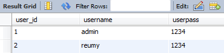
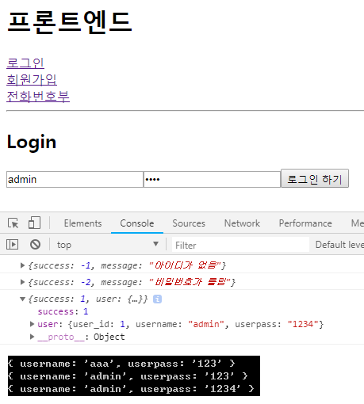

- 0623 이어서 작업
- 리덕스없이 작업

## 세팅

### frontend
```
npm install react-router-dom --save
```
App.js
```
import React, { Component } from 'react';
import { 
  BrowserRouter as Router,
  Route,
  Link
} from 'react-router-dom';

import Login from './Login';
import Register from './Register';
import Phone from './Phone';

class App extends Component {
  render() {
    return (
      <Router>
        <div className="App">
          <h1>프론트엔드</h1>
          <Link to="/">로그인</Link><br />
          <Link to="/register">회원가입</Link><br />
	  <Link to="/phone">전화번호부</Link>
          <hr />
          <Route exact path="/" 
            render={()=><Login />} />
          <Route exact path="/register" 
            render={()=><Register />} />
          <Route exact path="/phone" 
            render={()=><Phone />} />
        </div>
      </Router>
    );
  }
}

export default App;
```
Login.js
```
import React, { Component } from 'react';

class Login extends Component {
  render() {
    console.log(this.props)
    return (
      <div>
        <h2>Login</h2>			
      </div>
    );
  }
}

export default Login;
```
Phone.js
```
import React, { Component } from 'react';

class Phone extends Component {
  render() {
    return (
      <div>
        <h2>Phone</h2>			
      </div>
    );
  }
}

export default Phone;
```
Register.js
```
import React, { Component } from 'react';

class Register extends Component {
  render() {
    return (
      <div>
        <h2>Register</h2>			
      </div>
    );
  }
}

export default Register;
```
- 결과


> Router 안에 있는 것들의 정보를 콘솔로 찍음 console.log(this.props)
> <Login /> 으로는 state를 전달할 수 없기 때문에 history, match, location을 전달받을 수 없음<br/> 해결은 props를 받아주면 됨
```
<Route exact path="/" render={(props)=><Login {...props} />} />
<Route exact path="/register" render={(props)=><Register {...props} />} />
<Route exact path="/phone" render={(props)=><Phone {...props} />} />
```
> 라우트가 전달해주는 props에 {...props} 기존의 객체를 그대로 가짐 (es6)
- 결과

<br />


## 로그인
Login.js
```
<input type="text" name="username" onChange={this.handleChange.bind(this)} />
<input type="password" name="userpass" onChange={this.handleChange.bind(this)} />
<button onClick={this.handleClick.bind(this)}>로그인 하기</button>		
```
```
state = {
  username : '',
  userpass : ''
}

handleChange(e){
  this.setState({ [e.target.name] : e.target.value });
}
```
> name과 state의 key값이 같으면 하나의 메소드로 같이 사용가능
```
handleClick(){
  axios.post('http://localhost:4000/login',this.state)
       .then((response)=>{
         console.log(response.data);
       })
       .catch(err=>{
         console.log(err);
       })
}
```
```
import axios from 'axios';
```
> axios는 Ajax와 같은 기능

- `axios.create : http://* 를 따로 저장해서 간편하게 사용할 수 있음`

### backend
```
app.post('/login',(req,res)=>{
  console.log(req.body);
  res.json({success:1});
})
```
> 결과를 만족했다는 의미로 1을 단순히 명명한 것

## DB
<br/>
<br/><br/>

- 결과


> 개발자도구와 터미널에 각각 찍힘
```
app.post('/login',(req,res)=>{
  console.log(req.body);
  connection.query(`SELECT * FROM users WHERE username="${req.body.username}"`,(err,rows)=>{
    err && console.log(err);
    console.log(rows);
  })
})
```
- 코드분석
```
`SELECT * FROM users WHERE username="${req.body.username}"`
```
- `｀｀ (블록쿼터) : 비구조적할당 방식`<br/>이 방식일때는 엔터를 쳐도 됨 (엔터치고 \ 로 이어주는 등의 방식이 필요없음)
```
err && console.log(err);
```
> IF문 대신 사용

- 결과


> 로그인 버튼을 누르면 입력한 정보가 cmd로 넘어옴
```
app.post('/login',(req,res)=>{
  console.log(req.body);
  connection.query(`SELECT * FROM users WHERE username="${req.body.username}"`,(err,rows)=>{
    err && console.log(err);
    if (rows.length > 0) {
      if (req.body.userpass == rows[0].userpass) {
        res.json({success:1, user:rows[0]});
      } else {
        res.json({success:-2, message:'비밀번호가 틀림'});
      }
    } else {
      res.json({success:-1, message:'아이디가 없음'});
    }
  })
})
```
> {success:*} 해당 키값과 숫자는 임의로 명명한것

- 결과

<br/>
Login.js
```
handleClick(){
  axios.post('http://localhost:4000/login',this.state)
     .then((response)=>{
       console.log(response.data);
       if (response.data.success === 1) {
         this.props.history.push('/phone');
       } else if (response.data.success === -1) {
         alert(response.data.message);
         return;
       } else if (response.data.success === -2) {
         alert(response.data.message);
         return;
       }
    })
    .catch(err=>{
      console.log(err);
    })
}
```
- 코드분석
```
('http://localhost:4000/login',this.state)
```
> {this.state} 는 어짜피 객체 자체를 넘기는거라서 {}를 생략해줌

- 결과
> 위에 결과의 메세지가 alert 창으로 뜨고, 로그인 성공시에는 phone 페이지로 넘어감

## 전화번호부
- 로그인한 user_id에 맞게 전화번호를 저장할 것
- 여러사람이 각각 자신의 전화번호부를 사용하기위해 user_id가 필요한 것

### 세팅
Phone.js
```
import axios from 'axios';

class Phone extends Component {

  handleChange(e){
    this.setState({[e.target.name] : e.target.value});
  }

  handleClick(){
    axios.post('http://localhost:4000/phone',this.state)
        .then(response=>{
          console.log(response.data);
        })
        .catch(error=>{
          console.log(error);
        })
  }

  render(){
    return(			
      <div>
        <h2>Phone</h2>
          <input type="text" name="phoneName" onChange={this.handleChange.bind(this)} />
          <input type="text" name="phoneNumber" onChange={this.handleChange.bind(this)} />
          <button onClick={this.handleClick.bind(this)}>등록</button>
      </div>
    )
  }
}
```
### frontend
App.js
```
state = {
  logged : false,
  selectedID : ''
}
```
> logged는 로그인상태를 알려주며 false일땐 로그아웃상태 (리덕스를 사용할땐 리덕스에 넣기)
```
isLogin(userID){
  this.setState({selectedID:userID});
}
```
```
<Route exact path="/" 
  render={props=><Login {...props}
  status={this.state.logged}
  isLogin={this.isLogin.bind(this)} />} />
...
<Route exact path="/phone" 
  render={props=><Phone {...props}
  status={this.state.logged}
  isSelected={this.state.selectedID} />} />
```
Login.js
```
this.props.isLogin(response.data.user.user_id);
```
> 로그인에 성공하면 해당 아이디의 DB user_id가 isLogin의 인자로 들어옴 이게 App.js에 전달되어 selectedID의 벨류값으로 들어가 setState가 되어 phone.js로 전달됨 

Phone.js
```
state = {
  phoneName : '',
  phoneNumber : '',
  userID : this.props.isSelected
}
```
> 전달받은 user_id(selectedID)값이 isSeleted값으로 전달됨

- 결과


> admin(user_id:1)으로 로그인 후 전화번호부를 등록하면 DB에 해당 정보가 user_id:1로 등록됨<br/>reumy(2)로 로그인 후 등록하면 해당 정보는 user_id:2로 등록됨


#### 로그인 후 로그인페이지 막기
- Redirect 이용
- params(/:userID)를 이용하지 않는 이유는 다른 메뉴에 다녀왔을경우 문제가 될 수 있기 때문
App.js
```
isLogin(userID){
  this.setState({logged:true, selectedID:userID});
}
```
Login.js
```
import { Redirect } from 'react-router-dom';
```
```
{this.props.status && <Redirect to="/phone" />}
```
> 앞이 ture일때 뒤로 보냄

Phone.js
```
import { Redirect } from 'react-router-dom';
```
```
{!this.props.status && <Redirect to="/" />}
```
- admin(1) 로 로그인 후 react 개발자도구 확인

<br/><br/>

- 새로고침하면 처음 상태로 돌아가기 때문에 즉, status가 false로 바뀌기 때문에 세션, 쿠키 등을 이용해 로그인 상태를 유지시켜주어야 함

### TIP
- 리퀘스트 당 하나의 리스폰스
- 엔터를 이용해서 로그인할때는 keyup을 이용
- 다양한 코드가 나올때는 switch 문이 편리함
