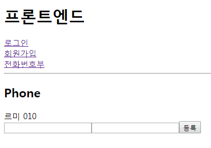
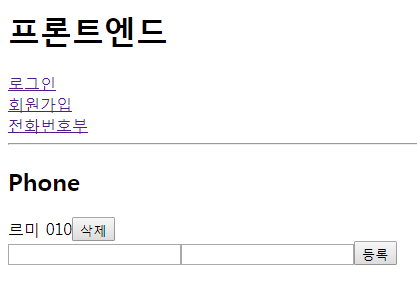
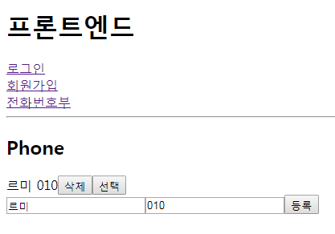
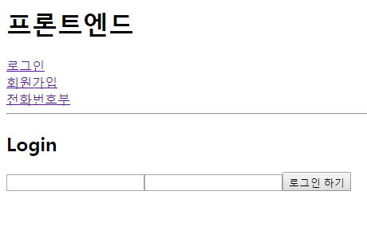

## 해당 로그인 정보의 주소록 가져오기
Phone.js
```
state = {
  ...
  list : []
}
```
```
componentDidMount(){
  this.getList();
}
```
> Ajax 통신 (처음 데이터를 가지고 올때 실행)
```
getList(){
  axios.get(`http://localhost:4000/phone/${this.state.userID}`)
     .then(response=>{
       console.log(response.data);
       this.setState({list:response.data.list, phoneName:'', phoneNumber:''});
  }).catch(error=>{
      console.log(error);
  })
}
```
> 이 부분은 back이 먼저 구현되고 구현해야 함 (지금은 이미 생각을 해놨으니 먼저 구현함)
```
render(){
  const { list } = this.state;
  const phoneList = list.map((value)=>{
    return(
      <div key={value.phone_id}>{value.name} {value.number}</div>
    )
  })

  return(
    ...
    <div>
      {phoneList}
    </div>
    ...
  )
}
```
sever.js
```
app.get('/phone/:user_id',(req,res)=>{
  connection.query(`SELECT * FROM phonebook WHERE user_id="${req.params.user_id}"`,(err,rows)=>{
  err && console.log(rows);
  res.json({success:1, list : rows});
  })
})
```
- admin 으로 로그인 결과

<br/>
> 아이디가 admin인 정보의 전화번호부 리스트가 출력됨

```
handleClick(){
  ...
  .then(response=>{
    this.getList();
    this.setState();
    console.log(response.data);
  })  
}
```
> 등록버튼을 눌렀을때 바로바로 리스트가 출력됨

## 삭제하기
Phone.js
```
const phoneList = list.map((value)=>{
  return(
    <div key={value.phone_id}>{value.name} {value.number}
      <button onClick={this.handleDelete.bind(this,value.phone_id)}>삭제</button>
    </div>
  )
})
```
```
handleDelete(phone_id){
  axios.delete(`http://localhost:4000/phone/${phone_id}`)
      .then(response=>{
        this.getList();
        this.setState();
      }).catch(error=>{
          console.log(error);
      })
}
```
> this.setState() 은 this.setState({phoneName:'', phoneNumber:''}) 와 같음
sever.js
```
app.delete('/phone/:phone_id',(req,res)=>{
  console.log(req.params.phone_id)
  connection.query(`DELETE FROM phonebook WHERE phone_id="${req.params.phone_id}"`,(err,rows)=>{
    err && console.log(rows);
    res.json({success:1});
  })
})
```
- 결과

<br/>
> 리스트에 삭제버튼이 생기고 삭제버튼을 누르면 삭제됨

```
handleDelete(phone_id){
  ...
  .then(response=>{
    ...
    this.pname.focus();
  })
  ...
}
```
```
<input type="text" name="phoneName"
  onChange={this.handleChange.bind(this)}
  ref={(ref)=>this.pname=ref} />
```
> 삭제하면 바로 커서가 첫번째 input박스에 포커스 됨
- `ref : input 자체로 선택자와 같은 것`

## 선택하고 수정하기
### 선택
Phone.js
```
const phoneList = list.map((value)=>{
  return(
    ...
    <button onClick={this.handleSelect.bind(this,value.phone_id)}>선택</button>
  )
})
```
```
<input type="text" name="phoneName"
  value={this.state.phoneName}
  onChange={this.handleChange.bind(this)} />
<input type="text" name="phoneNumber"
  value={this.state.phoneNumber}
  onChange={this.handleChange.bind(this)} />
```
```
handleSelect(phone_id){
  const { list } = this.state;
  let selected = list.filter(value=>phone_id === value.phone_id);
  this.setState({
    phoneName:selected[0].name, 
    phoneNumber:selected[0].number
  })
}
```
> 아래 코드를 축약해서 씀
```
let selected = list.filter((value)=>{
  return phone_id === value.phone_id;
})
```
- 결과

<br/>
> 선택한 리스트의 정보가 input박스에 들어옴


### 수정
Phone.js
```
<button onClick={this.handleUpdate.bind(this)}>수정</button>
```
```
handleUpdate(){
  axios.put(`http://localhost:4000/phone/${this.state.updateID}`,{name:this.state.phoneName, number:this.state.phoneNumber})
    .then(response=>{
      this.getList();
    }).catch(error=>{
        console.log(error);
    })
}
```
```
render(){
  const { list, updateID } = this.state;
}
```
```
state = {
...
updateID : ''
}
```
```
handleSelect(phone_id){
  ...
  this.setState({
    phoneName:selected[0].name, 
    phoneNumber:selected[0].number, updateID : phone_id
  })
}
```
- 결과
> 원하는 리스트를 선택 후 수정하여 수정버튼을 누르면 해당정보로 수정됨


## 부가작업
```
{updateID && <button>취소</button>}
```
> 선택버튼을 누르면 취소버튼이 생김
```
{!updateID && <button onClick={this.handleClick.bind(this)}>등록</button>}
```
> 선택버튼을 누르면 등록버튼이 사라짐
```
{updateID && <button onClick={this.handleCancel.bind(this)}>취소</button>}

handleCancel(){
  this.setState({phoneName:'', phoneNumber:'', updateID:''});
}
```
> updateID를 비워주면 등록버튼 다시 생김

- 최종 결과

<br/><br/>

## TIP
- restful api : 설계방법
- 맵은 배열을 가지고 또 다른 배열은 만듬
